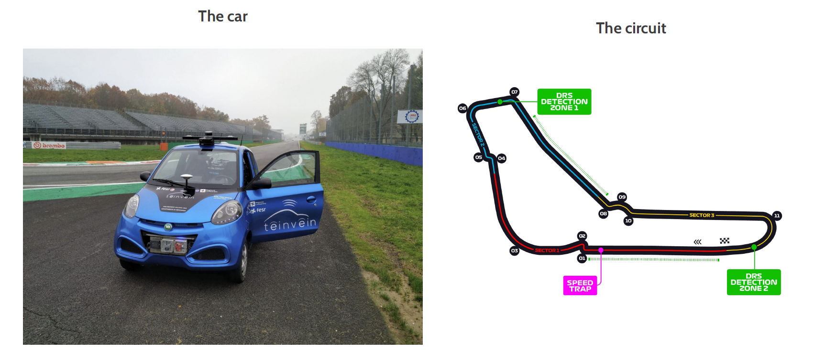
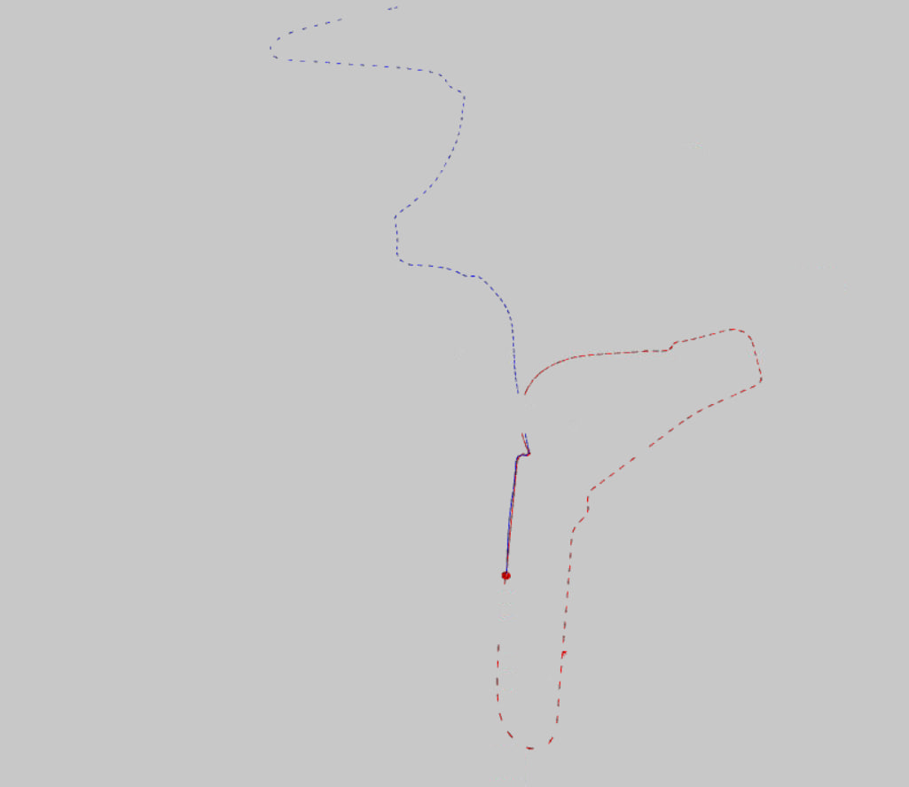
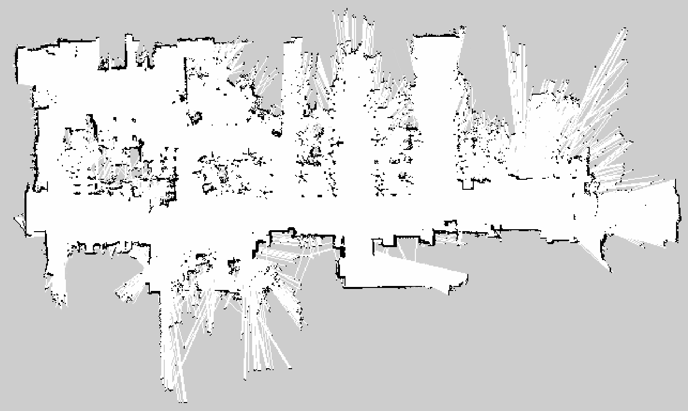

# ROS Projects at Politecnico di Milano - course of Robotics [A.A. 2024/2025]

## Authors

- Matteo Pompilio
- Piero Burigana
- Merve Rana Kizil

---

## First Project

In `robotics/catkin_ws/src/first_project/` you can find the implementation of odometry and sector timing for a mobile car robot using ROS, working directly with raw vehicle and GPS data, at the Monza circuit.



### Project Structure

- **Task 1: Odometry from Vehicle Data**
  - Process messages from vehicle sensors to compute odometry.
  - Subscribes to `/speedsteer` topic (`geometry_msgs/PointStamped`):  
    - `y`: speed (km/h)  
    - `x`: steering wheel angle (deg)
  - Publishes odometry (`nav_msgs/Odometry`) to `/odom` and broadcasts a TF transform from `odom` to `vehicle`.

- **Task 2: Odometry from GPS**
  - Subscribes to `/swiftnav/front/gps_pose` topic (`sensor_msgs/NavSatFix`).
  - Converts latitude, longitude, altitude to ECEF, then to local ENU coordinates.
  - Publishes odometry (`nav_msgs/Odometry`) to `/gps_odom` and broadcasts a TF transform from `odom` to `gps`.
  - Allows manual configuration of reference point via launch file parameters (`lat_r`, `lon_r`, `alt_r`).

- **Task 3: Sector Times and Speed**
  - Subscribes to both vehicle and GPS topics.
  - Publishes sector time and average speed (custom message on `/sector_times`).

### How to Run

1. **Preparation**
    - All launch and config files are in the `launch/` directory.

2. **Start the System**
    - Use the included launch file (automatically starts all nodes and RViz visualization):

      ```bash
      roslaunch first_project launch.launch
      ```

3. **Play the ROS Bag File**
    - Run the bag file containing recorded data:

      ```bash
      rosbag play --clock data/project.bag
      ```

4. **Visualization**
    - Use RViz for visualizing odometry topics and TFs.
    - The arrows represent different odometry sources (blue: vehicle odom, with expected huge bias after the first straigth sector with respect to the red track, from GPS odom).
    

### Requirements

- ROS Noetic
- RViz for visualization
- Bag file: `project.bag`

### Provided Folders

- `src/` – Source code for all nodes.
- `launch/` – Launch files to start the system and RViz.
- `cfg/` – RViz configuration files.

---

## Second Project

In `robotics/catkin_ws/src/second_project/` you can find the implementation of a mapping and navigation pipeline for a mobile robot using ROS.


### Project Structure

- **Task 1: Mapping**
  - Use two 2D LiDAR scans and robot odometry from a ROS bag to reconstruct an environment map
  - Data topics: `/scan_back`, `/scan_front`, `/odometry`, `/tf`, `/tf_static`
  - Merge the two lasers for 360° coverage and **filter out points belonging to the robot**
  - Export the map as a `.png` image and a `.yaml` file.

- **Task 2: Navigation**
  - Simulate the robot in Stage using the generated map.
  - Setup navigation stack to localize and plan using the static map.
  - Drive to goals loaded from a CSV file, published via a custom node using ROS actions.
  - Visualize in RViz: robot, map, TFs, particle cloud (AMCL), paths, goals.

### How to Run

1. **Mapping**
    - Edit and use the launch files in `launch/`:

      ```bash
      roslaunch second_project mapping.launch
      ```

    - Play the bag file:

      ```bash
      rosbag play --clock data/robotics2.bag
      ```

    - Save the map using *map_server*:

      ```bash
      rosrun map_server map_saver -f ./catkin_ws/src/second_project/map/map
      ```

      

2. **Navigation**
    - Use the included launch files in `launch/`.
    - The map from Task 1 must be placed in the `map/` folder.
    - Run with simulated time enabled.
    - Goals are read automatically from `csv/goals.csv`.

3. **Visualization**
    - On Windows, connect to [http://localhost:8080/vnc.html](http://localhost:8080/vnc.html)
    - RViz configuration files are provided in `cfg/`.
    - View the map, robot, sensors, and navigation status.

### Requirements

- ROS Noetic
- Mapping package: gmapping
- Stage simulator
- Additional ROS packages: `map_server`, `move_base`, `amcl`
- RViz for visualization
- Bag file: `robotics2.bag`

### Provided Folders

- `mapping/` – Source and launch files for Task 1.
- `navigation/` – Source and launch files for Task 2.
- `map/` – Output map files.
- `csv/` – File with navigation goals.
- `cfg/` – RViz configs.
